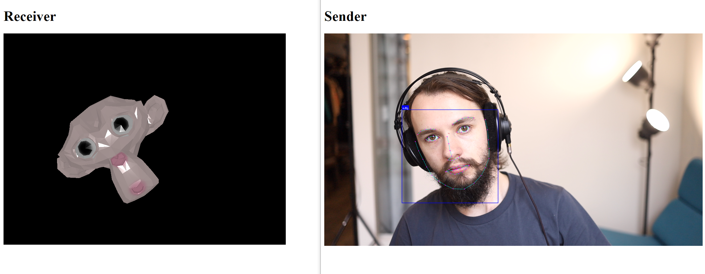

# Mesh Call
This is an unfinished (i.e. barely started) proof-of-concept I built during the 2020 lockdowns to see how well a 3D model could be used in place of video for videoconferencing.

I'm too busy to keep working on this, so rather than just shelving it I figured I'd publish what I have.

## Concept
Everyone has been dealing with networking issues during lockdown, due in part to the high bandwidth requirements.
I got to thinking about how skinned 3d models are controlled using very little data and realized this could work for video chat as well.

If we calculate a couple of control values from the sender's video, we could instead send these and animate a 3d model of the user's head on the recievers end.

### Math
At the very minimum, I'd want to calculate two vector3's for position and rotation, as well as values for how open the mouth and both eyes are.
At 12 FPS, this would be 9 * 12 float's per second or 432 bytes / second.

I'm obviously ignoring audio here, but you'd want to just send the usual stream alongside the control points.

## Demo

This demo just shows that you can send head tilt over WebRTC to control a 3d model on the receiver's end.

### How It Works
1. A WebRTC session is established between the sender and receiver.
2. The tilt of the sender's head is calculate from its center's distance to the bottom center of the video stream.
3. This angle is sent to the receiver, which rotate's Suzanne (the 3d monkey head) to received rotation.

### Setup
1. `pip3 install -r requirements.txt`
2. `./setup.sh`
3. Open `localhost:5000/send.html`.
4. Open `localhost:5000/recv.html` in another window.
5. Wait for the face overlay to show in `send.html`. At this point, tilting your head should tilt the 3D head.

## Next Steps
I don't know that I'm going to keep working on this.
That said, these are the next steps:
1. Add support full rotation, position and openness values.
2. Add audio.
3. Make bidirectional.
4. Add better 3d model.